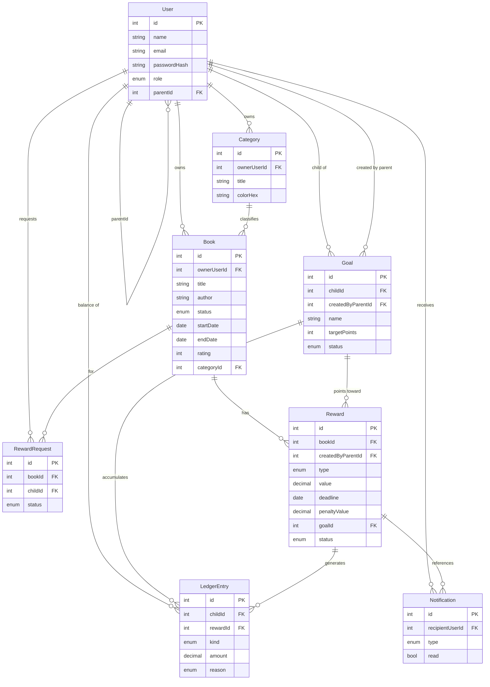

# 02 · Modelo de datos

## 1. Entidades

### User
| Campo | Tipo | Notas |
|-------|------|-------|
| id | PK | |
| name | string | |
| email | string | único |
| passwordHash | string | |
| role | enum(PARENT, CHILD) | |
| parentId | FK User (nullable) | solo en CHILD; apunta al PARENT |
| createdAt | datetime | |

### Category
| Campo | Tipo | Notas |
|-------|------|-------|
| id | PK | |
| ownerUserId | FK User | dueño de la categoría |
| title | string | |
| description | string (nullable) | |
| colorHex | string | color identificativo (hex `#RRGGBB`) |
| createdAt | datetime | |

> Cada usuario (padre o hijo) tiene sus propias categorías.

### Book
| Campo | Tipo | Notas |
|-------|------|-------|
| id | PK | |
| ownerUserId | FK User | lector propietario del libro |
| title | string | |
| author | string | |
| status | enum(NOT_STARTED, READING, FINISHED) | |
| startDate | date (nullable) | |
| endDate | date (nullable) | |
| notes | text (nullable) | |
| rating | int (nullable, 0-5) | |
| categoryId | FK Category (nullable) | |
| createdAt | datetime | |
| updatedAt | datetime | |

### Goal (Meta)
| Campo | Tipo | Notas |
|-------|------|-------|
| id | PK | |
| childId | FK User | hijo al que pertenece la meta |
| createdByParentId | FK User | padre que la creó |
| name | string | p. ej. "PlayStation" |
| description | string (nullable) | |
| targetPoints | int | puntos necesarios para canjearla |
| status | enum(ACTIVE, ACHIEVED, REDEEMED) | |
| createdAt | datetime | |

### Reward
| Campo | Tipo | Notas |
|-------|------|-------|
| id | PK | |
| bookId | FK Book | libro del hijo asociado |
| createdByParentId | FK User | padre que la creó |
| type | enum(POINTS, MONEY) | |
| value | decimal | puntos (entero) o euros (2 decimales) |
| deadline | date | fecha límite |
| penaltyValue | decimal (nullable) | penalización si no se cumple |
| goalId | FK Goal (nullable) | **requerido si type = POINTS** |
| status | enum(PENDING, FULFILLED, PENALIZED) | |
| resolvedAt | datetime (nullable) | |
| createdAt | datetime | |

### RewardRequest
| Campo | Tipo | Notas |
|-------|------|-------|
| id | PK | |
| bookId | FK Book | libro del hijo |
| childId | FK User | hijo solicitante |
| status | enum(PENDING, RESOLVED, DISMISSED) | |
| createdAt | datetime | |
| resolvedAt | datetime (nullable) | |

### Notification
| Campo | Tipo | Notas |
|-------|------|-------|
| id | PK | |
| recipientUserId | FK User | destinatario |
| type | enum(REWARD_REQUEST, REWARD_FULFILLED, REWARD_PENALIZED, GOAL_ACHIEVED) | |
| refBookId | FK Book (nullable) | |
| refRewardId | FK Reward (nullable) | |
| message | string | |
| read | bool | por defecto false |
| createdAt | datetime | |

### LedgerEntry (saldo / transacciones)
| Campo | Tipo | Notas |
|-------|------|-------|
| id | PK | |
| childId | FK User | hijo titular del saldo |
| rewardId | FK Reward (nullable) | origen de la transacción |
| kind | enum(POINTS, MONEY) | |
| amount | decimal | positivo (cumplimiento) / negativo (penalización o canje) |
| goalId | FK Goal (nullable) | meta a la que aportan los puntos |
| reason | enum(FULFILLED, PENALTY, REDEMPTION) | |
| createdAt | datetime | |

> El saldo de un hijo se calcula agregando las `LedgerEntry`. En **MONEY** se permite saldo negativo.

## 2. Diagrama ER

## 3. Notas de integridad
- `Reward.goalId` es obligatorio cuando `type = POINTS` y la meta debe pertenecer al mismo hijo dueño del libro.
- Al borrar un `User` hijo se eliminan en cascada sus libros, categorías, metas, solicitudes, notificaciones y ledger (política a confirmar en implementación).
- `Book.rating` restringido a 0-5; `Category.colorHex` validado como hex.
