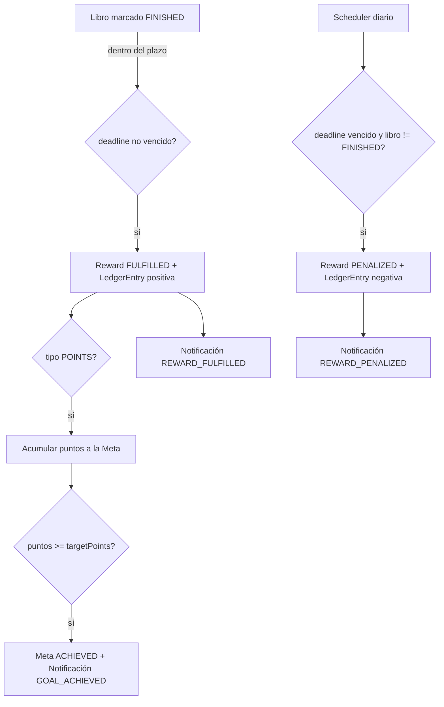

# 04 · Arquitectura

## 1. Stack tecnológico

| Capa | Tecnología |
|------|------------|
| Frontend | React + Vite + TypeScript, React Router, TanStack Query, Axios, MUI, gráficos (Recharts / MUI X Charts) |
| Backend | Node.js + NestJS (TypeScript) |
| ORM | Prisma (alternativa: TypeORM) |
| Base de datos | PostgreSQL (por defecto) o MySQL/MariaDB, seleccionable con `DB_PROVIDER` |
| Autenticación | JWT (access token) + guards de rol |
| Tareas programadas | `@nestjs/schedule` (resolución de recompensas) |
| Contenedores | Docker + Docker Compose |

## 2. Capas del backend (transporte / dominio / persistencia)

Desde la Fase 4 (y con Auth/Users refactorizados en la Fase 5), **todo** el
backend se organiza en **3 capas** estrictas. El dominio no importa a
NestJS ni a Prisma; la persistencia implementa interfaces del dominio; el
transporte (NestJS) cablea ambas:

| Capa | Carpeta | Contiene | Prohibido importar |
|------|---------|----------|--------------------|
| **Dominio** | `src/domain/<entidad>/` | Entidades, interfaces de repositorio, use cases, errores de dominio | `@nestjs/*`, `@prisma/client` |
| **Persistencia** | `src/persistence/<entidad>/` | Implementaciones Prisma de las interfaces de repositorio | — (acopla Prisma al dominio) |
| **Transporte** | `src/transport/<entidad>/` | Controllers, DTOs (class-validator), módulos Nest | lógica de negocio |
| **Infra global** | `src/prisma/`, `src/health/` | `PrismaService` (@Global), health check | lógica de negocio |

Entidades ya migradas: `users` (Auth + gestión de hijos), `categories`,
`books`, `goals`, `rewards`, `ledger` (motor de resolución + saldo),
`notifications`, `reward-requests`, `stats`. `src/transport/shared/`
contiene piezas reutilizadas por todos los módulos: `ActorResolver` (JWT
→ `ActorView`) y `DomainExceptionFilter` (errores de dominio → HTTP).

**Backend completo (Fases 1-10)**: todas las entidades del modelo de datos
están implementadas en 3 capas. Las fases 11+ son frontend.

```
backend/src/
├── domain/
│   ├── shared/          # domain-errors.ts, actor.ts, role.types.ts
│   ├── users/           # user.entity.ts, user.repository.ts (+token), password.util.ts, use-cases.ts
│   ├── categories/       # category.entity.ts, category.repository.ts (+token), use-cases.ts
│   └── books/            # book.entity.ts, book.repository.ts (+token), use-cases.ts
│   ├── goals/            # goal.entity.ts, goal.repository.ts (+token), use-cases.ts (depende también de UserRepository)
│   ├── rewards/          # reward.entity.ts, reward.repository.ts (+token), use-cases.ts (depende de Book+Goal+UserRepository)
│   ├── ledger/           # ledger-entry.entity.ts, ledger.repository.ts (+token), use-cases.ts (motor de resolución, redeem, balance; depende también de NotificationRepository)
│   ├── notifications/    # notification.entity.ts, notification.repository.ts (+token), use-cases.ts
│   ├── reward-requests/  # reward-request.entity.ts, reward-request.repository.ts (+token), use-cases.ts (depende de Book+Notification+UserRepository)
│   └── stats/            # stats.entity.ts (formas de resultado), stats.repository.ts (+token), use-cases.ts (reusa Goal+LedgerRepository)
├── persistence/
│   ├── users/            # prisma-user.repository.ts
│   ├── categories/        # prisma-category.repository.ts
│   ├── books/             # prisma-book.repository.ts
│   ├── goals/             # prisma-goal.repository.ts
│   ├── rewards/           # prisma-reward.repository.ts
│   ├── ledger/            # prisma-ledger.repository.ts
│   ├── notifications/     # prisma-notification.repository.ts
│   ├── reward-requests/   # prisma-reward-request.repository.ts
│   └── stats/             # prisma-stats.repository.ts (Prisma groupBy + agregación en memoria)
├── transport/
│   ├── shared/            # actor-resolver.ts, domain-exception.filter.ts
│   ├── auth/               # auth.controller/module.ts, guards/, decorators/, strategies/, dto/
│   ├── users/              # users.controller/module.ts, dto/
│   ├── categories/         # categories.controller/module.ts, dto/
│   ├── books/              # books.controller/module.ts, dto/ (invoca ResolveBookFinishedUseCase al terminar un libro)
│   ├── goals/              # goals.controller/module.ts, dto/ (rutas anidadas /children/:childId/goals + /goals/*)
│   ├── rewards/            # rewards.controller/module.ts, dto/ (rutas /books/:bookId/rewards + /rewards/*)
│   ├── ledger/             # ledger.controller/module.ts, reward-penalization.scheduler.ts (@Cron diario)
│   ├── notifications/      # notifications.controller/module.ts, dto/
│   ├── reward-requests/    # reward-requests.controller/module.ts, dto/ (rutas /books/:id/request-reward + /reward-requests/*)
│   └── stats/              # stats.controller/module.ts, dto/ (/stats/me, /stats/overview?childId=)
├── prisma/                # PrismaService + PrismaModule (@Global)
├── health/
├── tests/                 # *.test.ts (Vitest): <entidad>-domain / <entidad>-persistence
├── app.module.ts
└── main.ts
```

### Use cases con más de un repositorio (Goals, Rewards)
`goals` no tiene `ownerUserId` propio (pertenece a un `childId`), así que
sus use cases de padre (`CreateGoalUseCase`, `ListChildGoalsUseCase`,
`UpdateGoalUseCase`, `DeleteGoalUseCase`) reciben **dos** interfaces:
`GoalRepository` y `UserRepository` (del dominio `users`, reutilizada tal
cual). El segundo repo solo se usa para comprobar "¿este `childId` es hijo
del actor?" — la validación de propiedad vive en el dominio, no en la
persistencia ni en el transporte. `GoalsModule` reusa el `USER_REPOSITORY`
ya exportado por `AuthModule` (mismo `PrismaUserRepository`, sin duplicar
wiring).

`rewards` va un paso más allá: sus use cases de escritura dependen de
**hasta cuatro** repos (`RewardRepository` + `BookRepository` +
`GoalRepository` + `UserRepository`), porque una recompensa cuelga de un
libro (`bookId`) cuyo propietario hay que resolver para saber "¿es hijo
del actor?". Para ello se añadió `BookRepository.findByIdAny(id)` (sin
acotar por owner) — Rewards no conoce de antemano quién es el dueño del
libro. `RewardsModule` es *self-contained*: como `BooksModule`/`GoalsModule`
no exportan sus tokens, provee sus **propias** instancias de
`PrismaBookRepository`/`PrismaGoalRepository` (solo reusa `USER_REPOSITORY`
de `AuthModule`, que sí los exporta).

Regla de visibilidad establecida en Rewards (aplicable a futuros dominios
con el mismo patrón, p. ej. RewardRequests en Fase 9): en **lecturas**
(list/get) un acceso cruzado devuelve **404** (privacidad, no revela
existencia); en **escrituras** (create/update/delete) devuelve **403**
(`OwnershipError`), porque ahí la comprobación de propiedad SÍ es el
camino real de aplicación (el repo subyacente no acota por owner), a
diferencia de Categories/Books donde el 403 es solo defense-in-depth.

### Motor de resolución + ledger (Fase 8)
`domain/ledger/` es el dominio con más orquestación cruzada: una única
función interna (`resolvePendingReward`) decide FULFILLED/PENALIZED
comparando `hoy` con `deadline`, y la reutilizan DOS use cases distintos
según qué dispara la resolución:
- `ResolveBookFinishedUseCase` — INMEDIATA: `BooksController.updateOne`
  la invoca justo después de un `PATCH /books/:id` que deja el libro en
  `FINISHED`, antes de responder al cliente.
- `PenalizeOverdueRewardsUseCase` — DIFERIDA: la ejecuta
  `RewardPenalizationScheduler` (`@Cron(CronExpression.EVERY_DAY_AT_MIDNIGHT)`)
  una vez al día sobre TODAS las recompensas `PENDING` del sistema, como
  red de seguridad si la inmediata no llegó a dispararse.

El saldo (`GetMyBalanceUseCase`/`GetChildLedgerUseCase`) y el progreso de
una meta hacia su `targetPoints` NUNCA se guardan como columna: se
DERIVAN sumando `LedgerEntry.amount` (`sumByChild`/`sumByGoal`). El canje
(`RedeemGoalUseCase`) solo procede si `Goal.status === 'ACHIEVED'`; la
transición de estado del sistema (`ACHIEVED`/`REDEEMED`) usa un método
dedicado `GoalRepository.setStatus()`, separado del `update()` que solo
el padre puede invocar (nombre/descripción/`targetPoints`).

`BooksModule` y `LedgerModule` son *self-contained* como `RewardsModule`:
cada uno instancia sus propios repos Prisma (`PrismaRewardRepository`,
`PrismaGoalRepository`, `PrismaLedgerRepository`, `PrismaBookRepository`
según corresponda) en vez de importar los módulos de transporte de esas
entidades (que no exportan sus tokens).

### Notificaciones + Solicitudes de recompensa (Fase 9)
`domain/notifications/` es un dominio simple de lectura/marcado (bandeja
propia por `recipientUserId`) que CREAN otros dominios; nunca se crea a
sí mismo desde su propio transporte. Dos productores:
- `domain/reward-requests/` (`CreateRewardRequestUseCase`): al solicitar
  recompensa, crea la `RewardRequest` y notifica al padre
  (`REWARD_REQUEST`) usando `actor.parentId` (ya resuelto por
  `ActorResolver` desde el JWT — sin consulta extra a `UserRepository`).
- `domain/ledger/` (`resolvePendingReward`, motor de resolución de la
  Fase 8): tras crear/actualizar el `LedgerEntry`, notifica
  `REWARD_FULFILLED`/`REWARD_PENALIZED` al hijo, y `GOAL_ACHIEVED` al
  hijo Y al padre (dos notificaciones) cuando una meta llega a
  `targetPoints`. Por eso `ResolveBookFinishedUseCase` y
  `PenalizeOverdueRewardsUseCase` reciben un 5º repo (`NotificationRepository`),
  y `BooksModule`/`LedgerModule` proveen también su propia instancia de
  `PrismaNotificationRepository` (mismo patrón self-contained).

`ResolveRewardRequestUseCase` (padre resuelve/descarta) reusa
`assertOwnsChild` exportado de `domain/goals`, igual que `RedeemGoalUseCase`
y `GetChildLedgerUseCase` — una sola implementación de "¿es mi hijo?"
compartida por los tres dominios que la necesitan.

### Estadísticas / dashboards (Fase 10)
`domain/stats/` no escribe nada: agrega datos de otros dominios para los
dashboards. Reusa `GoalRepository`/`LedgerRepository` para
`goalsProgress`/`balance` (mismo cálculo que Ledger, sin duplicarlo) y
añade un `StatsRepository` propio solo para las agregaciones que NINGUNA
de las interfaces existentes ofrece: `booksByStatus`/`rewardsByStatus`
(Prisma `groupBy` + `_count`, agregación real en BD) y
`finishedBooksByPeriod`/`avgReadingDays` (calculadas en memoria sobre un
`findMany` acotado, porque Prisma no expresa `YEAR()`/`DATEDIFF()` de
forma portable en `groupBy`/`aggregate` sin `$queryRaw`).

`GetOverviewStatsUseCase` reusa también `assertOwnsChild`: sin `childId`
agrega TODOS los hijos del padre + un `ranking` derivado (no hace falta
una query de agregación aparte: se calcula orientando los resultados ya
obtenidos por hijo); con `childId` filtra a uno solo y omite `ranking`.

### Reglas de cableado (DI)
- Los use cases reciben **interfaces** (no existen en runtime) → no pueden ser
  token de NestJS vía `design:paramtypes`. Cada módulo de transporte:
  - `{ provide: X_REPOSITORY, useExisting: PrismaXRepository }`
  - use cases con `useFactory: (repo) => new XUseCase(repo)` inyectando el token.
- El actor lo resuelve el transporte (`ActorResolver` en `transport/shared/`:
  `request.user` + `parentId`) y pasa un `ActorView` al dominio — el dominio
  no ve `Request`/JWT.
- Los errores de dominio (`DomainNotFound`, `OwnershipError`, `ConflictError`,
  `DomainValidation`, `AuthenticationError`) se traducen a 404/403/409/400/401
  por `DomainExceptionFilter` (por módulo, no global).
- La firma del JWT (`JwtService.signAsync`) es un detalle de transporte: el
  dominio (`LoginUseCase`) solo valida credenciales y devuelve `SafeUser`; el
  `AuthController` compone `{ accessToken, user }`.
- El hashing de contraseñas (scrypt, `node:crypto`) vive en el dominio
  (`domain/users/password.util.ts`): es una API del runtime de Node, no de
  NestJS/Prisma, por lo que no rompe la regla de capas.

## 3. Estructura del monorepo

```
TFM_MyReadings/
├── backend/                 # API NestJS + Prisma
│   ├── prisma/
│   │   ├── schema.prisma
│   │   ├── migrations/
│   │   └── seed.ts
│   ├── src/
│   │   ├── domain/              # entidades, interfaces repo, use cases (sin NestJS/Prisma)
│   │   ├── persistence/         # implementaciones Prisma de los repos
│   │   ├── transport/           # controllers, DTOs, módulos Nest (auth/users/categories/books/shared)
│   │   ├── prisma/  health/      # infra global (PrismaService @Global, health check)
│   │   ├── tests/               # *.test.ts (Vitest): unitarios de dominio + persistencia
│   │   ├── tests-e2e/           # *.e2e.test.ts (Vitest): HTTP real contra dist/main.js compilado
│   │   ├── app.module.ts
│   │   └── main.ts
│   ├── vitest.config.ts         # tests unitarios/persistencia (src/tests/**)
│   ├── vitest.e2e.config.ts     # tests E2E (src/tests-e2e/**), timeout más alto, sin paralelismo
│   ├── smoke-*.ps1              # smoke tests HTTP manuales por fase (complementan los E2E)
│   └── Dockerfile
├── frontend/                # SPA React + Vite
│   ├── src/
│   │   ├── api/             # cliente axios + hooks TanStack Query
│   │   ├── auth/            # AuthContext, rutas protegidas
│   │   ├── components/
│   │   ├── pages/
│   │   └── main.tsx
│   └── Dockerfile
├── docs/                    # documentación del proyecto
├── docker-compose.yml
└── README.md
```

## 4. Módulos del backend (NestJS)

| Módulo | Responsabilidad |
|--------|------------------|
| `AuthModule` | Registro de padre, login, emisión/validación de JWT, guards |
| `UsersModule` | Perfil, alta y gestión de cuentas hijo por el padre |
| `CategoriesModule` | CRUD de categorías por usuario |
| `BooksModule` | CRUD de libros, transiciones de estado |
| `GoalsModule` | CRUD de metas (padre) |
| `RewardsModule` | CRUD de recompensas + reglas de negocio |
| `RewardRequestsModule` | Solicitudes de recompensa del hijo |
| `NotificationsModule` | Bandeja in-app, marcado de leídas |
| `LedgerModule` | Saldo de puntos/euros, canje de metas |
| `StatsModule` | Endpoints de agregación para dashboards |
| `SchedulerModule` | Tarea programada de resolución de recompensas |
| `CommonModule` | `JwtAuthGuard`, `RolesGuard`, `OwnershipGuard`, DTOs, filtros de excepción |

### Seguridad y validación
- `JwtAuthGuard`: exige token válido.
- `RolesGuard` + decorador `@Roles(...)`: restringe por rol (PARENT / CHILD).
- `OwnershipGuard`: verifica que el recurso pertenece al usuario (o a un hijo suyo).
- DTOs validados con `class-validator` + `ValidationPipe` global.
- Contraseñas con hash **scrypt** (`node:crypto`, sin dependencias nativas — compatible Linux/Windows/Docker). CORS configurado. Variables sensibles vía `.env`.

## 5. Frontend

**Fase 11 (base, ✅ implementada)**:
- `src/types/auth.ts`: `Role` (`PARENT`/`CHILD`) y `AuthUser`.
- `src/api/client.ts`: instancia Axios (`baseURL` = `VITE_API_URL` o proxy `/api` de Vite); token en
  `localStorage` (`myreadings_token`); interceptor de request añade `Authorization: Bearer`;
  interceptor de response detecta 401 y llama a un handler registrado vía `setUnauthorizedHandler`
  (pub-sub, para no acoplar el cliente HTTP a React), salvo en las propias llamadas de
  `/auth/login`/`/auth/register`.
- `src/api/auth.api.ts` y `src/api/notifications.api.ts`: funciones tipadas por endpoint, sin lógica
  de estado (la gestiona TanStack Query / el componente).
- `src/auth/AuthContext.tsx`: `AuthProvider` con `login()`/`logout()`; al montar solo llama a
  `/auth/me` si ya hay token en `localStorage` (evita un 401 esperado en la primera carga sin
  sesión); registra `logout` como el handler global de 401 (cierre de sesión automático si el token
  expira o es inválido en cualquier llamada). `useAuth()` lanza si se usa fuera del provider.
- `src/auth/ProtectedRoute.tsx`: guarda por estado de autenticación (`CircularProgress` mientras
  carga, `Navigate` a `/login` si no autenticado) y opcionalmente por `roles` (si el rol no coincide,
  redirige al home del propio rol en vez de a un 403 — evita pantallas rotas).
- `src/auth/RoleHomeRedirect.tsx`: resuelve `/` a `/parent` o `/child` según el rol.
- `src/components/layout/AppLayout.tsx` + `NotificationBell.tsx`: layout común con `AppBar`
  (título, chip de rol, nombre, botón "Salir") y campana de notificaciones (badge con no leídas vía
  polling de 30s, desplegable con bandeja perezosa que se marca como leída al clicar o con "Marcar
  todas"; ambas mutaciones invalidan la query `['notifications']`).
- `src/App.tsx`: `AuthProvider` envolviendo `Routes` — `/login`, `/register` (públicas),
  `/parent`/`/child` (protegidas por rol), `/` (protegida, redirige por rol), `*` → `/`.
- `src/pages/{Login,Register}Page.tsx`: formularios controlados con `useState`; solo los padres se
  registran (los hijos los crea el padre autenticado desde `/api/users/children`, fuera del alcance
  de Fase 11).
- `src/pages/{Parent,Child}DashboardPage.tsx`: placeholders envueltos en `AppLayout`; el contenido
  funcional (libros, metas, recompensas, estadísticas) llega en la Fase 12.
- Nota de scaffolding: falta `src/vite-env.d.ts` en la configuración inicial de Fase 1
  (`/// <reference types="vite/client" />`), necesario para que `import.meta.env` tipe correctamente
  bajo `tsc -b` estricto; añadido en Fase 11.

**Fase 12 (funcionalidades, ✅ implementada)**:
- Capa API por entidad en `src/api/` (`categories`, `books`, `children`, `goals`, `rewards`,
  `reward-requests`, `ledger`, `stats`) con tipos en `src/types/` que reflejan exactamente los DTOs
  y respuestas del backend (contrato verificado leyendo los controllers/DTOs, no solo la doc).
- `AppLayout` ampliado con navegación por pestañas (`Tabs` + `Link` de react-router), distinta por
  rol: padre ve Dashboard/Libros/Categorías/Hijos/Metas/Recompensas; hijo ve
  Dashboard/Libros/Categorías.
- `CategoriesPage`, `BooksPage` + `BookDetailPage` (edición, transiciones de estado acotadas al
  estado actual, aviso + botón "Solicitar recompensa" solo para el hijo con libro `NOT_STARTED`),
  `ChildrenPage` (solo padre), `GoalsPage` (solo padre, por hijo seleccionado), `RewardsPage` (solo
  padre: bandeja de solicitudes pendientes + gestión de recompensas existentes).
- `components/stats/ChildStatsPanel.tsx`: panel reutilizable (KPIs + gráficos Recharts + barras de
  progreso de metas) usado tanto por `ChildDashboardPage` (`/stats/me`) como por
  `ParentDashboardPage` (un panel por hijo sobre `/stats/overview`, con selector "Todos"/un hijo y
  tabla de ranking cuando aplica).
- **Restricción de diseño clave**: `Book` no tiene vista compartida padre↔hijo (a diferencia de
  `Category`) — el padre nunca puede listar ni ver el detalle de un libro de su hijo. Por eso el
  único punto de entrada del padre para crear una `Reward` es la bandeja de `RewardRequest`
  (que sí incluye `bookId` + `childId`), nunca una navegación libre por los libros del hijo.


## 6. Despliegue con Docker

`docker-compose.yml` con tres servicios:

| Servicio | Descripción |
|----------|-------------|
| `db` | PostgreSQL (por defecto) o MariaDB/MySQL con volumen persistente, según `DB_PROVIDER` |
| `backend` | API NestJS; ejecuta migraciones Prisma al arrancar |
| `frontend` | SPA servida (build de Vite tras un proxy/servidor estático) |

Configuración por variables de entorno (`DATABASE_URL`, `JWT_SECRET`, `PORT`, etc.).

**Verificado de extremo a extremo en Fase 13** (`docker compose up`): `db` (healthy) →
`backend` (`prisma migrate deploy` + Nest arrancado) → `frontend` (nginx sirviendo la SPA y
haciendo de proxy `/api/` → `http://backend:3000`). Login real a través de
`http://localhost:4173/api/auth/login` confirma la cadena completa.

Ambos Dockerfiles usan **`node:20` (Debian/glibc)**, no `node:20-alpine`: en Alpine (musl) Prisma
no detecta bien la versión de OpenSSL y puede fallar al descargar/ejecutar el binario del
schema-engine (síntoma real encontrado: funcionaba en build pero fallaba al arrancar el contenedor,
porque `prisma migrate deploy` descarga ese binario en el primer arranque si no quedó cacheado).

Para redes con proxy de inspección TLS (p. ej. entornos corporativos): cada Dockerfile copia
`certs/extra-ca.pem` (VACÍO por defecto, sin efecto) y fija `NODE_EXTRA_CA_CERTS` a esa ruta tanto
en la etapa de build como en la de producción. Si `npm install`/`prisma generate`/`prisma migrate
deploy` fallan por certificados, basta sustituir el contenido de `backend/certs/extra-ca.pem` y
`frontend/certs/extra-ca.pem` por el bundle de CA local antes de reconstruir — nunca se commitea un
certificado real al repositorio.

## 7. Flujo de resolución de recompensas


