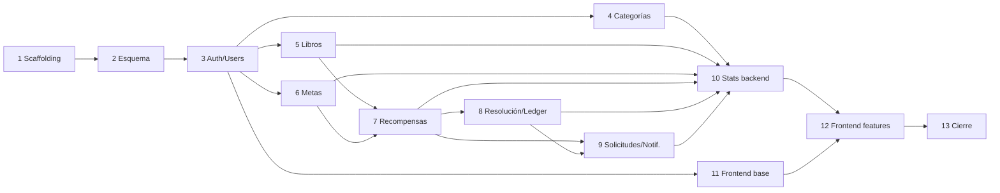

# 05 · Plan de fases

Cada fase incluye sus dependencias y criterios de verificación. Las fases de backend preceden
a las de frontend que las consumen.

## Fase 1 — Scaffolding e infraestructura
- Monorepo (`backend/`, `frontend/`), Docker Compose (mysql + api + web), configuración base
  (ESLint, Prettier, tsconfig, `.env.example`).
- **Verificación**: `docker compose up` levanta los tres servicios sin errores.

## Fase 2 — Esquema de datos
- Esquema Prisma con todas las entidades, migraciones iniciales y `seed` de datos de prueba.
- **Dependencias**: Fase 1.
- **Verificación**: migración aplicada; seed carga un padre, dos hijos, categorías y libros.

## Fase 3 — Autenticación y usuarios
- Registro de padre, login JWT, guards de rol, alta y gestión de cuentas hijo por el padre.
- **Dependencias**: Fase 2.
- **Verificación**: login devuelve token válido; el padre crea un hijo; un hijo no puede crear hijos.

## Fase 4 — Categorías (CRUD)
- CRUD de categorías por usuario con validación de color hex.
- **Dependencias**: Fase 3.
- **Verificación**: un usuario solo ve/gestiona sus categorías.

## Fase 5 — Libros (CRUD)
- CRUD de libros (estado, fechas, notas, rating, categoría); alta por hijo o por padre.
- **Dependencias**: Fase 3.
- **Verificación**: transiciones de estado válidas; `rating` 0-5; propiedad respetada.

## Fase 6 — Metas (CRUD)
- CRUD de metas del hijo gestionadas por el padre.
- **Dependencias**: Fase 3.
- **Verificación**: solo el padre crea metas para sus hijos.

## Fase 7 — Recompensas (CRUD + reglas)
- CRUD de recompensas con reglas: solo `NOT_STARTED`, solo padre sobre sus hijos, enlace a meta
  si es de puntos, `deadline` futura.
- **Dependencias**: Fases 5 y 6.
- **Verificación**: no se puede crear/editar si el libro no está en `NOT_STARTED`.

## Fase 8 — Motor de resolución + ledger
- Tarea programada de resolución (`@nestjs/schedule`), ledger de saldo (puntos/euros) y canje
  de metas. Cumplimiento inmediato al marcar `FINISHED`; penalización al vencer el plazo.
- **Dependencias**: Fase 7.
- **Verificación**: `FINISHED` a tiempo → `FULFILLED` inmediato y suma al ledger; vencido → `PENALIZED` (euros puede ir negativo).

## Fase 9 — Solicitudes y notificaciones
- `RewardRequest` (solicitud del hijo), bandeja de notificaciones in-app, avisos de
  cumplida/penalizada/meta lograda.
- **Dependencias**: Fases 7 y 8.
- **Verificación**: "Solicitar recompensa" crea `RewardRequest` + `Notification` al padre.

## Fase 10 — Estadísticas / dashboards (backend)
- Módulo `Stats` con endpoints de agregación; `RolesGuard` restringe padre→sus hijos,
  hijo→sí mismo.
- **Dependencias**: Fases 4-9.
- **Verificación**: el padre solo agrega datos de sus hijos; el hijo solo los suyos (403 en caso contrario).

## Fase 11 — Frontend base
- AuthContext, layout, rutas protegidas por rol, cliente Axios + TanStack Query.
- **Dependencias**: Fase 3.
- **Verificación**: login/logout funcional; redirección por rol.

## Fase 12 — Frontend funcionalidades
- Libros, categorías, gestión de hijos, recompensas, metas, bandeja de notificaciones, botón
  "Solicitar recompensa" con aviso al empezar a leer, dashboards con gráficos y selector de hijo.
- **Dependencias**: Fases 2-11.
- **Verificación**: flujo E2E manual completo (ver más abajo).

## Fase 13 — Cierre
- Validaciones cruzadas, tests unitarios (servicios) y e2e (reglas de recompensa y
  notificación), Docker final, documentación/memoria del TFM.
- **Dependencias**: todas las anteriores.
- **Verificación**: suite de tests en verde; `docker compose up` reproduce el entorno completo.

## Flujo E2E de referencia
1. El padre registra su cuenta y crea un hijo.
2. El hijo añade un libro y pulsa "Solicitar recompensa".
3. El padre recibe la notificación y crea una recompensa de puntos enlazada a una meta.
4. El hijo termina el libro dentro del plazo → recompensa cumplida, saldo sube.
5. Al alcanzar los puntos objetivo, la meta queda canjeable.
6. Los dashboards reflejan los datos (padre con filtro por hijo; hijo el suyo).

## Mapa de dependencias

